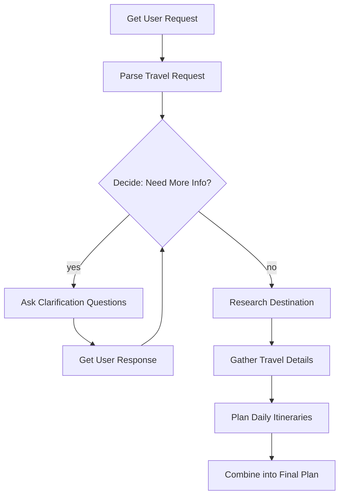

# AI Travel Guide with Pocketflow

An intelligent travel planning system that creates personalized travel guides for trips ranging from local day outings to international multi-week adventures.

## Features

- **Intelligent Information Gathering**: Automatically identifies missing trip details
- **Smart Clarification**: Asks targeted questions only when necessary
- **Web Research Integration**: Searches for destination information, activities, and recommendations
- **Day-by-Day Planning**: Creates detailed daily itineraries
- **Comprehensive Guides**: Generates complete travel guides with accommodations, transportation, and tips

## Architecture

This system follows **Pocketflow** design patterns:

- **Agent Pattern**: DecideNeedInfo node determines whether clarification is needed
- **Workflow Pattern**: Sequential processing from request → clarification → research → planning
- **Map-Reduce Pattern**: Breaks trip into days (map), then combines into comprehensive plan (reduce)

### Flow Diagram



## Project Structure

```
travel_guide/
├── main.py                    # Entry point
├── flow.py                    # Flow definition and connections
├── nodes.py                   # All node implementations
├── utils.py                   # Utility functions (LLM, web search)
├── requirements.txt           # Python dependencies
└── travel-guide-design.md     # Detailed design documentation
```

## Installation

1. Install dependencies:
```bash
pip install -r requirements.txt
```

2. Set up your LLM API key:
```bash
export GEMINI_API_KEY="your-api-key-here"
export SERPER_API_KEY="your-api-key-here"
```

Or modify `utils.py` to use your preferred LLM (OpenAI, Anthropic, etc.)

3. (Optional) Configure web search:
   - The current implementation uses mock web search
   - For production, integrate with Google Search API, Bing API, or SerpAPI
   - Update the `search_web()` function in `utils.py`

## Usage

Run the travel guide:

```bash
python main.py
```

Example interaction:

```
WELCOME TO AI TRAVEL GUIDE
================================================================================

Tell me about your travel plans!
Examples:
  - 'I want to visit Paris for 5 days'
  - 'Plan a weekend trip to the mountains'
  - 'I need a 2-week itinerary for Japan'

Your travel request: I want to visit Tokyo for 7 days with my family

[PARSED] Trip info: {'destination': 'Tokyo', 'duration_days': 7, 'travelers': 'family', ...}
[MISSING] Need clarification on: ['budget', 'travel_style']

I need a bit more information:
1. What's your approximate budget for this trip?
2. What style of travel do you prefer - luxury, mid-range, budget, or backpacker?

Your answers: Mid-range budget, around $3000 total

[RESEARCH] Completed 5 searches
[DETAILS] Gathered travel details across 4 categories
[PLANNING] Created 7 daily itineraries
[COMPLETE] Travel guide generated!

YOUR PERSONALIZED TRAVEL GUIDE
================================================================================
...
```

## Node Descriptions

### 1. GetUserRequest
- Captures initial travel request from user
- Provides examples for guidance

### 2. ParseRequest
- Extracts structured information (destination, dates, travelers, etc.)
- Identifies missing critical information
- Uses LLM with YAML structured output

### 3. DecideNeedInfo (Agent Node)
- Determines if clarification is needed
- Returns "clarify" or "proceed" action
- Limits clarification rounds to avoid infinite loops

### 4. AskClarification
- Generates contextual, friendly questions
- Focuses on missing critical information

### 5. GetUserClarification
- Collects user responses
- Parses answers to update trip information
- Loops back to decision node

### 6. ResearchDestination (Batch Node)
- Performs multiple web searches
- Gathers general destination information
- Considers user interests in search queries

### 7. GatherTravelDetails (Batch Node)
- Searches for specific categories:
  - Accommodations
  - Transportation
  - Restaurants
  - Activities
- Organizes results by category

### 8. PlanDailyItinerary (Batch Node)
- Creates detailed plans for each day
- Includes morning, afternoon, and evening activities
- Provides meal and transportation recommendations

### 9. CombineFinalPlan
- Synthesizes all information
- Creates comprehensive, formatted travel guide
- Includes overview, itinerary, tips, and budget

## Customization

### Using Different LLMs

Edit `utils.py` to use your preferred LLM:

**OpenAI:**
```python
from openai import OpenAI

def call_llm(prompt: str) -> str:
    client = OpenAI(api_key=os.getenv("OPENAI_API_KEY"))
    response = client.chat.completions.create(
        model="gpt-4",
        messages=[{"role": "user", "content": prompt}]
    )
    return response.choices[0].message.content
```

**Anthropic (Claude):**
```python
from anthropic import Anthropic

def call_llm(prompt: str) -> str:
    client = Anthropic(api_key=os.getenv("ANTHROPIC_API_KEY"))
    response = client.messages.create(
        model="claude-3-5-sonnet-20241022",
        messages=[{"role": "user", "content": prompt}]
    )
    return response.content[0].text
```

### Implementing Real Web Search

Replace the mock implementation in `utils.py`:

**Using SerpAPI:**
```python
from serpapi import GoogleSearch

def search_web(query: str) -> List[Dict]:
    search = GoogleSearch({
        "q": query,
        "api_key": os.getenv("SERPAPI_KEY")
    })
    results = search.get_dict()
    
    return [{
        "title": r["title"],
        "url": r["link"],
        "snippet": r["snippet"]
    } for r in results.get("organic_results", [])]
```

### Adjusting Clarification Behavior

Modify in `main.py`:
```python
shared = {
    ...
    "max_clarification_rounds": 3,  # Increase/decrease max rounds
    ...
}
```

Or edit `DecideNeedInfo` node in `nodes.py` to change decision logic.

## Design Principles

Following **Pocketflow** best practices:

1. **Separation of Concerns**: Data (shared store) separate from compute logic (nodes)
2. **Fail Fast**: Using Node retry mechanisms for robustness
3. **Batch Processing**: Efficient handling of multiple searches and daily plans
4. **Structured Output**: YAML format for reliable LLM parsing
5. **Agentic Decision**: Dynamic flow control based on available information

## Extending the System

### Add More Research Categories

In `GatherTravelDetails` node:
```python
categories = [
    f"{destination} {travel_style} hotels",
    f"{destination} transportation",
    f"{destination} restaurants",
    f"{destination} activities",
    # Add more:
    f"{destination} safety tips",
    f"{destination} local customs",
    f"{destination} weather forecast"
]
```

### Add Budget Breakdown Node

Create a new node:
```python
class CalculateBudget(Node):
    def prep(self, shared):
        return {
            "budget": shared["trip_info"]["budget"],
            "duration": shared["trip_info"]["duration_days"],
            "travelers": shared["trip_info"]["travelers"],
            "daily_plans": shared["daily_plans"]
        }
    
    def exec(self, data):
        # Use LLM to create budget breakdown
        prompt = f"Create budget breakdown for: {data}"
        return call_llm(prompt)
    
    def post(self, shared, prep_res, exec_res):
        shared["budget_breakdown"] = exec_res
```

Add to flow:
```python
plan_days >> calculate_budget >> combine_plan
```

### Add Persistent Storage

Modify the shared store to use a database:
```python
import json

def save_trip(shared):
    with open(f"trips/{shared['trip_info']['destination']}.json", "w") as f:
        json.dump(shared, f)

def load_trip(destination):
    with open(f"trips/{destination}.json", "r") as f:
        return json.load(f)
```

## Testing

Test individual nodes:
```bash
python nodes.py
```

Test utility functions:
```bash
python utils.py
```

Test flow creation:
```bash
python flow.py
```

## Troubleshooting

**LLM API Errors:**
- Check API key is set correctly
- Verify API quota/credits
- Check rate limits

**YAML Parsing Errors:**
- LLM sometimes generates malformed YAML
- Node retries will automatically handle this
- Increase `max_retries` in node creation if needed

**Missing Search Results:**
- Implement real web search API
- Mock implementation returns placeholder data

## Contributing

To improve this system:

1. Implement real web search integration
2. Add more travel categories (visas, insurance, packing lists)
3. Support multi-city trips
4. Add cost optimization algorithms
5. Integrate with booking APIs
6. Add visualization (maps, charts)

## License

This is an example implementation for educational purposes. Adapt as needed for your use case.

## References

- [Pocketflow Documentation](https://pocketflow.dev)
- [Agentic Coding Guide](https://pocketflow.dev/guide)
- [Design Patterns](https://pocketflow.dev/design_pattern)
