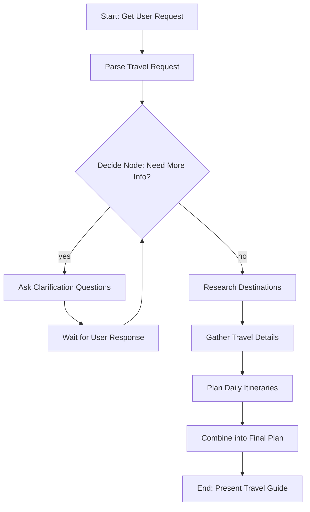

# Design Doc: AI Travel Guide Flow

## Requirements

Create an intelligent travel planning system that:
- Accepts user travel requests (from local day trips to international multi-week journeys)
- Intelligently identifies missing information and asks clarifying questions
- Gathers comprehensive travel information from the web
- Generates detailed, day-by-day itineraries
- Provides a comprehensive yet easy-to-follow travel plan

## Flow Design

### Applicable Design Pattern

1. **Agent Pattern**: Uses a decision node to determine whether more clarification is needed
2. **Workflow Pattern**: Sequential processing from gathering info → clarification → research → planning
3. **Map-Reduce Pattern**: Breaks down trip into days (map), then combines into comprehensive plan (reduce)

### Flow High-Level Design



### Node Descriptions

1. **GetUserRequest**: Captures initial travel request from user
2. **ParseRequest**: Extracts key information (destination, dates, etc.)
3. **DecideNeedInfo**: Determines if clarification needed (agent decision node)
4. **AskClarification**: Generates specific questions for missing information
5. **ResearchDestination**: Web search for destination info
6. **GatherTravelDetails**: Collects accommodation, transport, activities info
7. **PlanDailyItinerary**: Creates day-by-day plans (batch processing)
8. **CombineFinalPlan**: Merges all sections into comprehensive guide

## Utility Functions

1. **Call LLM** (`utils/call_llm.py`)
   - Input: prompt (str)
   - Output: response (str)
   - Used by most nodes for LLM tasks

2. **Search Web** (`utils/search_web.py`)
   - Input: query (str)
   - Output: search results (list of dict)
   - Used by research nodes to gather travel information

## Data Design

### Shared Store Structure

```python
shared = {
    # User input
    "user_request": "",
    
    # Parsed information
    "trip_info": {
        "destination": "",
        "trip_type": "",  # local/domestic/international
        "duration_days": None,
        "travelers": None,
        "budget": "",
        "travel_style": "",  # luxury/mid-range/budget/backpacker
        "interests": [],
        "start_date": "",
    },
    
    # Clarification tracking
    "missing_info": [],
    "clarification_questions": [],
    "clarification_round": 0,
    
    # Research results
    "destination_info": {},
    "accommodations": [],
    "transportation": {},
    "activities": [],
    "restaurants": [],
    
    # Final output
    "daily_plans": [],
    "final_travel_guide": ""
}
```

## Node Design

### 1. GetUserRequest
- **Type**: Regular Node
- **Steps**:
  - prep: None (initial node)
  - exec: Read user input
  - post: Store in `shared["user_request"]`

### 2. ParseRequest
- **Type**: Regular Node
- **Steps**:
  - prep: Read `shared["user_request"]`
  - exec: Use LLM to extract structured information
  - post: Store parsed data in `shared["trip_info"]`, identify missing fields in `shared["missing_info"]`

### 3. DecideNeedInfo
- **Type**: Regular Node (Decision/Agent Node)
- **Steps**:
  - prep: Read `shared["missing_info"]` and `shared["clarification_round"]`
  - exec: Use LLM to decide if clarification needed (returns "clarify" or "proceed")
  - post: Return action ("clarify" or "proceed")

### 4. AskClarification
- **Type**: Regular Node
- **Steps**:
  - prep: Read `shared["missing_info"]`
  - exec: Generate smart clarification questions
  - post: Store questions in `shared["clarification_questions"]`, print to user, increment `shared["clarification_round"]`

### 5. GetUserClarification
- **Type**: Regular Node
- **Steps**:
  - prep: Read `shared["clarification_questions"]`
  - exec: Get user input
  - post: Update `shared["trip_info"]` with new info, return "decide" to loop back

### 6. ResearchDestination
- **Type**: Batch Node
- **Steps**:
  - prep: Generate search queries based on destination
  - exec: Search web for each query
  - post: Store results in `shared["destination_info"]`

### 7. GatherTravelDetails
- **Type**: Batch Node
- **Steps**:
  - prep: Generate specific searches (hotels, transport, activities)
  - exec: Search web for each category
  - post: Store in respective categories in shared store

### 8. PlanDailyItinerary
- **Type**: Batch Node
- **Steps**:
  - prep: Return list of day numbers (1 to duration_days)
  - exec: For each day, create detailed plan using LLM + research data
  - post: Store all daily plans in `shared["daily_plans"]`

### 9. CombineFinalPlan
- **Type**: Regular Node
- **Steps**:
  - prep: Gather all sections (intro, daily plans, tips, etc.)
  - exec: Use LLM to format into comprehensive guide
  - post: Store in `shared["final_travel_guide"]`, print to user
